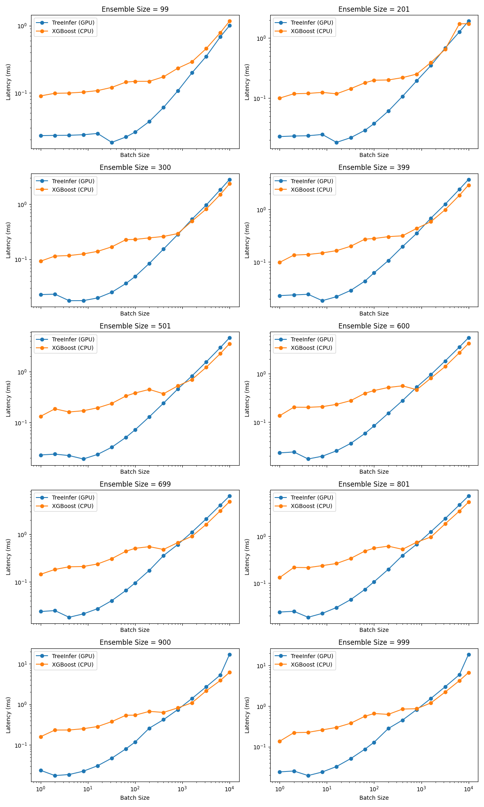
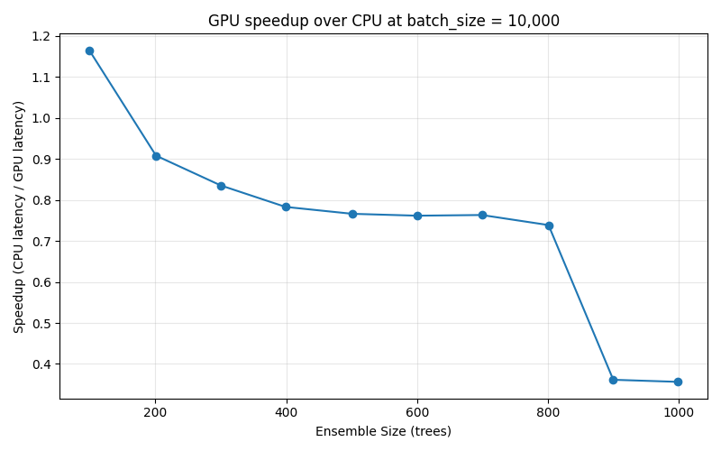
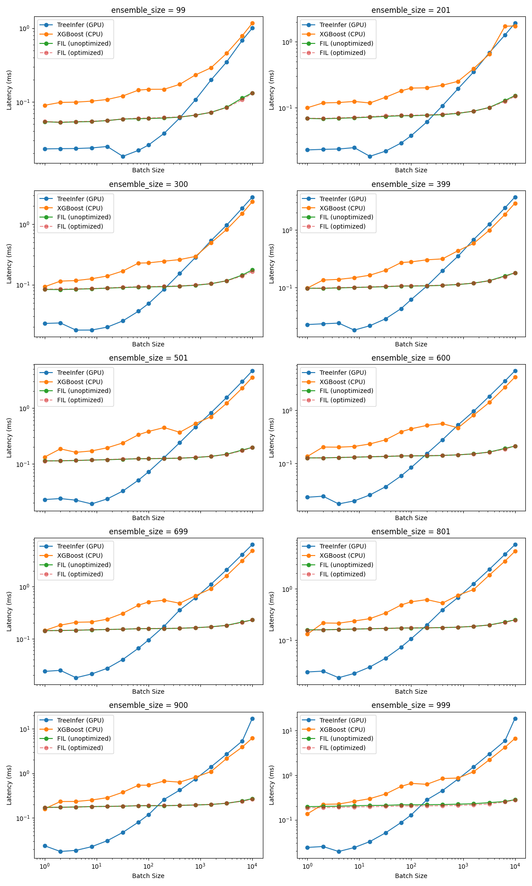

# gbdt-crossover
## From-Scratch CUDA Inference Engine for Gradient-Boosted Tree Ensembles

A CUDA inference engine for XGBoost gradient-boosted decision tree ensembles, built without using any existing tree-inference library, and a benchmark suite that measures where GPU inference actually a well-tuned CPU baseline. The engine parses XGBoost's serialised JSON model into its own in-memory representation, flattens every tree into a complete binary array laid out for the device, traverses the whole ensemble in one kernel, and reports host-to-device transfer, kernel execution, and device-to-host transfer as three separate numbers instead of one blended wall-clock figure.

What the project is really after is the measurement rather than the kernel. Published GPU tree-inference benchmarks usually compare against scikit-learn, which is not a serious CPU baseline. Here the comparison is XGBoost's own native C API predict path, run on the same physical machine as the GPU, plus NVIDIA's RAPIDS Forest Inference Library as a third reference point.

## Results

### Test hardware

Everything below was measured on a single [Runpod.io](https://www.runpod.io/) pod:

| | |
| --- | --- |
| GPU | 1x NVIDIA RTX 4090 (128 SMs, 24 GB GDDR6X, 72 MB L2) |
| vCPU | 16 (AMD Ryzen 9 7950X 16-Core Processor) |
| Memory | 61 GB |
| Container disk | 20 GB |

Both halves of the comparison ran on that pod. The GPU kernel and the XGBoost CPU baseline share a machine, a memory subsystem, and a thermal envelope, because measuring GPU latency on a rented instance and CPU latency on a laptop would have made the entire crossover claim meaningless. The 7950X is also a strong baseline in its own right, with 16 fast Zen 4 cores that XGBoost's OpenMP predict path uses by default.

Two consequences of this hardware are worth carrying into the results below. At batch size 1 against the largest ensemble, the kernel launches 999 threads in 4 blocks of 256, which occupies roughly 3% of the 4090's 128 SMs, so the small-batch regime is nowhere near using the machine. And the largest tree buffer in the sweep is 1.52 MB against 72 MB of L2, so every ensemble here sits entirely in cache and traversal never touches DRAM after the first pass.

### How the benchmark is set up

All three benchmarks (`gpu_bench`, `cpu_bench`, `fil_bench.py`) sweep the same fifteen batch sizes, run fifty seeded trials at each point, and score the same models against the same 15,000-row sample pool.

- **Models**: one XGBoost `multi:softmax` classifier with 3 classes, `max_depth=6`, 333 boosting rounds, trained on 9 features derived from a simulated geometric Brownian motion price path (rolling log return, realized volatility, and momentum at windows of 5, 10, and 20). The trained booster is then sliced by boosting round into ten ensembles of **99, 201, 300, 399, 501, 600, 699, 801, 900, and 999 trees**, so ensemble size becomes a second axis alongside batch size.
- **Batch sizes**: 1, 2, 4, 8, 16, 32, 64, 100, 200, 400, 800, 1600, 3200, 6400, 10000.
- **Trials**: 50 per (ensemble size, batch size) point, with the batch itself drawn once from the sample pool and held fixed across all 50 trials, so the repeats measure timing noise rather than input variation.
- **Warm-up**: one throwaway kernel launch before the first sweep, so CUDA context initialisation does not land inside any reported number.

The reasoning behind the model slicing, the sample pool composition, and the geometric batch spacing is in [Design Decisions](#design-decisions) below, since each of those choices exists to keep a specific confound out of the measurement.

Raw per-trial results are checked in:

| File | Contents |
| --- | --- |
| [`ground_truth/gpu_bench_results.csv`](ground_truth/gpu_bench_results.csv) | 7,500 rows, one per trial, with `h2d`, `kernel`, and `d2h` timed separately |
| [`ground_truth/cpu_bench_results.csv`](ground_truth/cpu_bench_results.csv) | 7,500 rows of XGBoost native `predict` latency |
| [`ground_truth/fil_bench_results.csv`](ground_truth/fil_bench_results.csv) | 15,000 rows of RAPIDS FIL latency, run twice per point (with and without FIL's `optimize()` call) |

`tools/analyse_crossover.py` aggregates these to median and p99 per point and prints the crossover tables; `tools/visualisations.ipynb` produces the plots.

### The crossover point

**There is no crossover in the tested range. The GPU is already ahead at batch size 1, against both baselines, for every one of the ten ensemble sizes.**

```
=== GPU vs CPU ===                              === GPU vs FIL ===
ensemble_size=99:  crossover at batch_size=1    ensemble_size=99:  crossover at batch_size=1
ensemble_size=201: crossover at batch_size=1    ensemble_size=201: crossover at batch_size=1
ensemble_size=300: crossover at batch_size=1    ensemble_size=300: crossover at batch_size=1
ensemble_size=399: crossover at batch_size=1    ensemble_size=399: crossover at batch_size=1
ensemble_size=501: crossover at batch_size=1    ensemble_size=501: crossover at batch_size=1
ensemble_size=600: crossover at batch_size=1    ensemble_size=600: crossover at batch_size=1
ensemble_size=699: crossover at batch_size=1    ensemble_size=699: crossover at batch_size=1
ensemble_size=801: crossover at batch_size=1    ensemble_size=801: crossover at batch_size=1
ensemble_size=900: crossover at batch_size=1    ensemble_size=900: crossover at batch_size=1
ensemble_size=999: crossover at batch_size=1    ensemble_size=999: crossover at batch_size=1
```

At a batch of a single sample, median end-to-end GPU latency sits at **0.023 ms to 0.024 ms** and barely moves as the ensemble grows from 99 trees to 999 trees. XGBoost's native predict path on the same machine ranges from 0.090 ms to 0.160 ms over the same models.

| Trees | GPU total (ms) | XGBoost CPU (ms) | Speedup | GPU p99 (ms) | CPU p99 (ms) |
| ---: | ---: | ---: | ---: | ---: | ---: |
| 99 | 0.0230 | 0.0900 | 3.91x | 0.0240 | 0.1357 |
| 201 | 0.0230 | 0.1002 | 4.36x | 0.0284 | 0.1524 |
| 300 | 0.0229 | 0.0926 | 4.04x | 0.0239 | 0.1606 |
| 399 | 0.0230 | 0.0985 | 4.28x | 0.0308 | 0.2023 |
| 501 | 0.0230 | 0.1329 | 5.77x | 0.0261 | 0.2523 |
| 600 | 0.0232 | 0.1358 | 5.85x | 0.0297 | 0.3848 |
| 699 | 0.0236 | 0.1437 | 6.09x | 0.0297 | 0.5449 |
| 801 | 0.0239 | 0.1307 | 5.47x | 0.0311 | 0.3908 |
| 900 | 0.0237 | 0.1603 | 6.76x | 0.0296 | 0.3396 |
| 999 | 0.0241 | 0.1362 | 5.65x | 0.0257 | 0.3735 |

The tail behaviour is the more interesting half of that table. GPU p99 stays within about 30% of GPU median, while CPU p99 runs two to four times CPU median and gets worse as the ensemble grows. At 699 trees the CPU p99 is 0.545 ms against a 0.144 ms median.



### The result holds at p99

A crossover found only in the medians would be a weak finding, since a median can hide a tail bad enough to disqualify the whole approach for latency-sensitive serving. Re-running the same analysis on the 99th percentile of each point's 50 trials moves nothing:

```
=== [p99] GPU vs CPU ===                  === [p99] GPU vs FIL ===
ensemble_size=99:  crossover at batch_size=1    ensemble_size=99:  crossover at batch_size=1
ensemble_size=201: crossover at batch_size=1    ensemble_size=201: crossover at batch_size=1
ensemble_size=300: crossover at batch_size=1    ensemble_size=300: crossover at batch_size=1
ensemble_size=399: crossover at batch_size=1    ensemble_size=399: crossover at batch_size=1
ensemble_size=501: crossover at batch_size=1    ensemble_size=501: crossover at batch_size=1
ensemble_size=600: crossover at batch_size=1    ensemble_size=600: crossover at batch_size=1
ensemble_size=699: crossover at batch_size=1    ensemble_size=699: crossover at batch_size=1
ensemble_size=801: crossover at batch_size=1    ensemble_size=801: crossover at batch_size=1
ensemble_size=900: crossover at batch_size=1    ensemble_size=900: crossover at batch_size=1
ensemble_size=999: crossover at batch_size=1    ensemble_size=999: crossover at batch_size=1
```

The only place p99 disagrees with the median at all is in where FIL eventually overtakes us at large batch, and it moves by one sweep point in each direction: ensemble 399 shifts from 400 to 200, and ensemble 501 shifts from 200 to 400. Both are single-step wobbles on a geometric axis rather than a change in the shape of the result.

### Why the GPU wins at batch 1

All three GPU stages have a fixed floor that a single sample does not come close to touching, and that floor is smaller than what XGBoost spends per call.

At 999 trees and batch size 1, the median breakdown is:

| Stage | Median (ms) | Share | Bytes moved |
| --- | ---: | ---: | ---: |
| Host to device | 0.0046 | 19% | 36 |
| Kernel | 0.0062 | 26% | |
| Device to host | 0.0129 | 54% | 3,996 |
| **Total** | **0.0241** | | |

Thirty-six bytes takes 4.6 microseconds to move, which is pure fixed cost; the same transfer at batch 10,000 moves ten thousand times as much data in only ten times the wall clock (0.046 ms for 360 KB). The kernel is similarly floor-bound: it holds between **6.1 and 7.2 microseconds from batch 1 all the way to batch 16** for every ensemble size in the sweep, and for the 99-tree model it stays flat out to batch 200. Almost none of that time is arithmetic, since it is launch and scheduling cost that would be paid on an empty kernel too.

The thread mapping matters here. Each thread handles one `(sample, tree)` pair, and `tree_idx` is the fast-varying half of the global id, so 32 consecutive threads in a warp get 32 different trees against the same sample. A batch of one against a 999-tree ensemble still launches 999 threads across 4 blocks rather than leaving a single lane doing all the work.

### Where the GPU stops winning

Running the sweep out to 10,000 samples flips the result for nine of the ten ensembles.

| Trees | Batch where XGBoost CPU overtakes the GPU |
| ---: | --- |
| 99 | never within the tested range |
| 201 | 3200 |
| 300 | 1600 |
| 399 | 1600 |
| 501 | 1600 |
| 600 | 800 |
| 699 | 1600 |
| 801 | 1600 |
| 900 | 1600 |
| 999 | 1600 |

The mechanism lives in the shape of the output rather than in the traversal. The kernel writes one float per `(sample, tree)` pair and leaves the summation across trees to the host, so the device-to-host payload is `batch x num_trees x 4` bytes while the host-to-device payload is only `batch x num_features x 4`. At 999 trees and 9 features that is a **111 to 1 asymmetry**: batch 10,000 sends 360 KB to the device and drags 39.96 MB back.

| Batch (999 trees) | H2D bytes | D2H bytes | D2H median (ms) | D2H share of total |
| ---: | ---: | ---: | ---: | ---: |
| 1 | 36 | 3,996 | 0.0129 | 54% |
| 100 | 3,600 | 399,600 | 0.1064 | 83% |
| 800 | 28,800 | 3,196,800 | 0.5823 | 71% |
| 1600 | 57,600 | 6,393,600 | 1.1035 | 72% |
| 6400 | 230,400 | 25,574,400 | 4.3016 | 74% |
| 10000 | 360,000 | 39,960,000 | 16.2413 | 87% |

By batch 10,000 the copy back is 87% of everything the GPU path does. The kernel itself takes 2.37 ms of an 18.66 ms total.

The same effect shows up as a function of ensemble size rather than batch size, since the output payload scales with tree count too:



There is a sharp discontinuity in that plot between 801 and 900 trees that is not explained by the payload growing. Effective device-to-host throughput in the benchmark holds at 5.5 to 6.0 GB/s all the way up to 32 MB (801 trees at batch 10,000, 5.48 ms) and then drops to about 2.4 GB/s at 36 MB (900 trees, 14.93 ms) and 40 MB (999 trees, 16.24 ms). This is stable rather than noisy: across the 50 trials at 900 trees the range is 14.80 ms to 15.40 ms. The Nsight Systems capture below shows the actual DMA for that same 39.96 MB taking only **3.09 ms**, so the extra time is host side, around the copy, not on the wire. The likely candidate is that the destination `std::vector` is freshly allocated on every trial and glibc serves allocations above 32 MB with `mmap`, handing back untouched zero pages that have to be faulted in during the copy, which would put the cliff exactly where it is. That has not been isolated with an experiment, so it stays a hypothesis.

### Nsight Systems profile

The `ncu_profile` binary runs one kernel launch against one model at one batch size, so a profiler sees a clean single-shot trace instead of fifty interleaved trials. It was run under `nsys profile` across the full batch-size sweep against the 999-tree model, and the `nsys stats` CSV exports are checked into [`profiling/`](profiling/) (one set per batch size, `.nsys-rep` and `.sqlite` files excluded).

| Batch | Kernel | D2H DMA | D2H size | Effective D2H |
| ---: | ---: | ---: | ---: | ---: |
| 1 | 3.58 us | 1.18 us | 4 KB | |
| 16 | 4.13 us | 5.70 us | 64 KB | |
| 100 | 10.91 us | 31.07 us | 0.40 MB | 12.9 GB/s |
| 800 | 135.87 us | 246.72 us | 3.20 MB | 13.0 GB/s |
| 3200 | 604.42 us | 981.61 us | 12.79 MB | 13.0 GB/s |
| 10000 | 1.93 ms | 3.09 ms | 39.96 MB | 12.9 GB/s |

Three things fall out of this. Kernel time is flat from batch 1 to batch 16 and only starts tracking batch size past 64, which is the same floor the CUDA event timings show. Device-to-host DMA runs at a flat 12.9 GB/s at every size, which rules the device out as the cause of the throughput cliff above and also sits well short of what the 4090's PCIe link manages with pinned memory. And `cudaEventCreate` shows a single call of **87 ms to 96 ms** in every one of the fifteen traces, which is lazy CUDA context initialisation charged to whichever API call happens to touch the driver first. The first `cudaLaunchKernel` in a fresh process costs another 51 to 58 microseconds. Both are one-time costs that the benchmark deliberately excludes with its warm-up launch, and both are real for a process that only ever scores one batch.

### Against RAPIDS FIL

FIL is timed differently from our own kernel, because `nvforest`'s Python API takes a host array and returns one, so `fil_bench.py` wraps a wall-clock timer around the whole `predict` call rather than decomposing it into stages. The comparison is therefore end-to-end call against end-to-end call, which is the fair way round given we cannot see inside FIL's stages.



Our kernel is faster than FIL from batch 1 and loses at large batch, and where it loses tracks ensemble size:

| Trees | FIL overtakes at batch (median) | FIL overtakes at batch (p99) |
| ---: | --- | --- |
| 99 | 800 | 800 |
| 201 | 400 | 400 |
| 300 | 400 | 400 |
| 399 | 400 | 200 |
| 501 | 200 | 400 |
| 600 | 200 | 200 |
| 699 | 200 | 200 |
| 801 | 200 | 200 |
| 900 | 200 | 200 |
| 999 | 200 | 200 |

At batch 1 against 999 trees, we come in at 0.024 ms against FIL's 0.197 ms. By batch 10,000 FIL is at 0.283 ms while we are at 18.66 ms, which is a factor of 66 in FIL's favour. That gap is not a statement about traversal quality. FIL reduces across trees on the device and returns one score per class per sample, so its output payload at 999 trees is 333 times smaller than ours. Almost the entire large-batch gap is the reduction we did not implement. FIL's own `optimize(batch_size=...)` call moves its numbers by at most a few percent (0.197 ms to 0.185 ms at 999 trees, batch 1) and by essentially nothing on the smaller ensembles, so both variants are plotted and both are in the results CSV.

The honest summary: at batch sizes of a few hundred and up, a mature production library beats this by a wide margin for a structural reason we understand and could fix. Below that, a fairly simple kernel with a good thread mapping is competitive with it and beats it outright at batch 1.

## Build

Everything that does not need a GPU builds and runs locally, including the model parser, the CPU reference traversal, and the correctness checker:

```bash
cmake -B build-local
cmake --build build-local
```

CUDA targets are behind an option that defaults to off, so a machine with no `nvcc` never tries to compile them:

```bash
cmake -B build-remote -DBUILD_CUDA=ON
cmake --build build-remote
```

`cpu_bench` links against the real `libxgboost` shipped inside the pip-installed `xgboost` package, located at configure time by asking Python where the package lives, since that path differs between a local machine and a rented instance.

### Reproducing the results

From the repository root:

```bash
python tools/train_model.py        # writes ground_truth/model.json, test_cases.csv, sweep_models/
python tools/generate_samples.py   # writes ground_truth/bench_samples.csv

# Correctness check that the kernel works as intended
./build-local/apps/parse_check/parse_check ground_truth/model.json ground_truth/test_cases.csv 6

# The three benchmarks
./build-remote/apps/gpu_bench/gpu_bench ground_truth/sweep_models ground_truth/bench_samples.csv 6 ground_truth/gpu_bench_results.csv
./build-remote/apps/cpu_bench/cpu_bench ground_truth/sweep_models ground_truth/bench_samples.csv ground_truth/cpu_bench_results.csv
python apps/fil_bench/fil_bench.py ground_truth/sweep_models ground_truth/bench_samples.csv ground_truth/fil_bench_results.csv
python apps/fil_bench/fil_bench.py ground_truth/sweep_models ground_truth/bench_samples.csv ground_truth/fil_bench_results.csv --optimised

python tools/analyse_crossover.py  # prints the median and p99 crossover tables
```

`ground_truth/` is gitignored apart from the three results CSVs, so regenerating the models and samples does not produce a dirty tree.

## Languages and Tooling

C++23 for everything on the host, CUDA C++20 for the device. `nlohmann/json` parses XGBoost's serialised model, `rapidcsv` reads the sample pools, and both are pulled in through CMake `FetchContent` rather than vendored. The error-checking wrapper around the CUDA runtime comes from [`cuda-utils`](https://github.com/MadhavMenon10/cuda-utils), which is also fetched at configure time. Model training and the plots are Python (`xgboost`, `pandas`, `matplotlib`); RAPIDS `nvforest` provides the FIL baseline.

## Directory Layout

```
core/                 model parsing, tree types, dense layout, CPU reference traversal
cuda/                 device model, traversal kernel, kernel launch and timing
apps/parse_check/     correctness gate: our CPU, our dense CPU, our GPU, all against XGBoost
apps/cpu_bench/       XGBoost native C API predict baseline
apps/gpu_bench/       batch-size sweep with per-stage timing
apps/fil_bench/       RAPIDS FIL baseline (fil_bench.py; the C++ attempt is kept disabled)
apps/ncu_profile/     single-launch binary for profiler capture
tools/                model training, sample generation, crossover analysis, plots
ground_truth/         benchmark result CSVs
plots/                generated figures
profiling/            nsys stats CSV exports across the batch-size sweep
```

## Design Decisions

### Project layout and CMake

One parent `CMakeLists.txt` declares the project and the `BUILD_CUDA` option, and every directory under it carries its own. Each target declares its own dependencies, include directories, and compile features locally, so `core` does not have to know that `gpu_bench` exists and adding a new app is one `add_subdirectory` line.

The reason this is load-bearing rather than cosmetic is the development machine. An M1 Mac has no CUDA toolchain at all, so `enable_language(CUDA)` failing would take the whole configure step down with it. Putting `enable_language(CUDA)` inside `cuda/CMakeLists.txt` and adding that subdirectory only when `BUILD_CUDA` is on means the local build never evaluates it. `apps/CMakeLists.txt` does the same thing for the GPU-only apps. The result is that the parser, the CPU reference traversal, the CPU baseline, and two thirds of the correctness gate all develop locally, and a rented GPU is only needed for the parts that have no other place to run.

### Index types and the leaf sentinel

`Node::left_child` and `Node::right_child` are `std::uint32_t`, and `k_no_child` is `UINT32_MAX` used as the leaf sentinel. That combination has to hold every node index a real tree can produce while leaving the sentinel unreachable.

A complete binary tree of depth `d` has `2^(d+1) - 1` nodes. GBDT trees are depth-limited by design: XGBoost's default `max_depth` is 6, and even a deep, lightly regularised configuration rarely goes past 10 to 12. Depth 10 is 2,047 nodes. Depth 20, which is well past anything realistically trained as a boosted tree, tops out around 2.1 million.

Against that, `uint16_t` caps at 65,535, which a depth-16 tree would already exceed. That is not comfortable headroom so much as a type that a real if unusual input could run over, and if the index space is ever exhausted the sentinel stops being distinguishable from a valid index. `uint32_t` caps at about 4.29 billion, roughly 2,000 times the depth-20 worst case, which puts the collision outside anything this project can be handed.

### Single-output scope

The device path is scoped to a single-output model. The kernel writes one leaf value per `(sample, tree)` pair and never reads a class index, so grouping trees by class, summing them, and adding the base score all stay on the host in `predict` and `predict_dense`. Multiclass output on the GPU is out of scope.

This is visible in the results rather than hidden by them: the per-`(sample, tree)` output is exactly what makes the device-to-host payload 111 times the host-to-device payload at 999 trees, and it is why FIL, which does reduce on the device, pulls so far ahead at large batch. The benchmark models are 3-class, so the GPU is doing the full traversal work for a multiclass model while leaving the class-aware reduction to the CPU.

### Building the ensemble sweep by slicing, not retraining

`generate_sweep_models` trains one booster to 333 rounds and then slices it with `booster[0:count]` at ten round counts, giving ensembles of 99 through 999 trees. Because boosting is additive and slicing keeps the first N rounds, the 99-tree ensemble's trees are literally the first 99 trees of the 999-tree ensemble, and every ensemble in the sweep shares its prefix with every larger one.

Training ten separate models instead would have varied the splits, the leaf values, and the effective depths independently at each size, so any timing difference across the ensemble-size axis would have mixed the effect of tree count with the effect of ten different model structures. Slicing makes tree count the only thing that changes.

### What goes in the benchmark sample pool

Two separate decisions here, both about keeping the timing measurement to two variables.

**No missing values in the timing pool.** `compute_features` produces NaN in its first 20 rows because the rolling windows have insufficient history, and `generate_sample_pool` trims exactly those. Missing-value handling is not unimportant, and `parse_check` tests it deliberately by injecting NaN into a separate test set. Keeping it out of the benchmark pool is about not letting an uncounted fraction of samples take the `default_left` branch instead of the threshold branch inside a measurement that is supposed to isolate batch size and ensemble size. If some unknown percentage of a batch silently traversed differently, timing differences could not be cleanly attributed to the two axes actually being studied.

**Random subsampling rather than a contiguous slice.** Consecutive rows of a GBM path are heavily correlated: one row's `roll_return_5` and the next row's share four of their five underlying price points, so they are overlapping windows sliding by one step rather than independent draws. Taking a contiguous slice would put all of one batch inside the same short stretch of simulated time, with a similar volatility regime, similar momentum, and likely similar real depth reached during traversal. A different batch drawn from elsewhere in the path could land in a different regime purely by where it sat, so which stretch a batch happened to come from would silently correlate with its timing and sit underneath the batch-size axis as a confound. `pool.sample(n=15000, random_state=42)` draws across the whole trimmed range instead, so no batch is biased toward one stretch of simulated conditions. It is the same category of concern that led to fixing each batch's sample subset across all 50 trials rather than reshuffling between them.

### Why the batch-size sweep is geometric

The sweep is 1, 2, 4, 8, 16, 32, 64, 100, 200, 400, 800, 1600, 3200, 6400, 10000, which is geometric rather than linear.

Everything interesting about this curve happens at small batch. That is where fixed costs (transfer setup, launch, scheduling) dominate total latency and where the curve actually bends, and it is the regime the project exists to characterise. Geometric spacing puts a point at every doubling through that region. Linear spacing with the same fifteen points would put almost all of its resolution in the flat, predictable high-batch region and step straight over the part that changes.

The sweep still runs out to 10,000 so both ends are characterised, since the large-batch behaviour turned out to carry the entire device-to-host story. On top of the fixed list, `gpu_bench` runs a second, dense pass over every integer batch size inside whichever adjacent pair of coarse points brackets the kernel-overtakes-transfer transition, which would have pinned that transition to an exact batch size. In practice that pass never ran, for the reason described under [Timing methodology](#timing-methodology).

### C++23 on the host, CUDA C++20 on the device

Host code is C++23 throughout (`core`, `cuda`, and every app declare `cxx_std_23`). The device standard for `fil_bench` is pinned separately with `set_target_properties(... CUDA_STANDARD 20 CUDA_STANDARD_REQUIRED ON)`, because `nvcc` on the toolkit available here does not accept C++23 as a CUDA dialect and setting `CUDA_STANDARD 23` fails the build. Pinning device code to 20 while host code stays at 23 compiles cleanly, and nothing in the kernels needs a C++23 feature.

`CUDA_STANDARD_REQUIRED ON` is the important half of that line. Without it CMake treats the standard as a preference and will quietly fall back to whatever the compiler does support, which turns a build-time error into a difference between two machines that nobody notices until behaviour diverges.

## Pipeline

### Model ingestion

`load_model` reads the output of XGBoost's `booster.save_model('model.json')`, not `dump_model(dump_format='json')`. The dump format is documented as not reloadable and stores trees as nested objects; the save format is a full serialisation with parallel arrays (`left_children`, `right_children`, `split_indices`, `split_conditions`, `base_weights`, `default_left`) that maps directly onto a flat node array.

A few quirks of that format have to be handled. `num_feature`, `num_class`, and `base_score` come through as JSON strings rather than numbers, so they get parsed with `std::from_chars` and, in `base_score`'s case, re-parsed as a nested JSON array. XGBoost encodes "no child" as `-1`, which becomes the `k_no_child` sentinel. Binary classification reports `num_class` as `0`, which gets normalised to `1`. And this schema version has no explicit `tree_info` array, so tree `i` belongs to class `i % num_classes`.

`Node` is a flat struct rather than a pointer-based type, mirroring XGBoost's own array layout. `threshold` and `value` are `float` rather than `double`, which halves the bytes that have to move per node, and tree traversal is memory bound long before it is precision bound. Both `Tree` and `Model` validate in their constructors, so a caller can never get hold of a model whose nodes reference features that do not exist.

### Dense tree layout

`Node` and `Tree` are shaped for parsing rather than for the device: nodes sit in whatever order XGBoost wrote them, and reaching a child means following an index that could point anywhere. `DenseNode` and `DenseTree` are the device-facing form. Every tree is expanded into a complete binary array of `2^(depth+1) - 1` nodes, so the left child of node `i` is at `2i + 1` and the right at `2i + 2`. No child pointers are stored at all, which drops `left_child` and `right_child` from the struct and leaves a 12-byte `DenseNode`.

The cost is memory for trees that are not balanced, since a complete array is allocated regardless of how many nodes actually exist. At the depth 6 used throughout, that is 127 nodes per tree and 1.52 MB for a 999-tree ensemble, which is small enough that the upload is a one-time cost that does not appear in any per-batch measurement.

`generate_dense_tree` walks the source tree recursively and places each node at its complete-tree position, so the recursion follows source structure while the destination index is computed positionally. `DenseModel` applies that to every tree in an ensemble and carries the metadata (base scores, feature count, class count) the device side needs.

### Keeping the model on the device

The first version of the launch function uploaded the whole tree ensemble on every trial, which quietly wrecked the measurement. The `h2d` number was almost entirely the cost of re-sending 1.52 MB of unchanged tree data, and the actual new data (under 4 KB even at batch 100) was lost inside it.

`DeviceModel` fixes this by flattening every tree's nodes into one contiguous buffer and uploading it once at construction, timing that upload separately from anything the benchmark reports. Copy and move are both deleted, since copying would leave two objects holding the same device pointer and both destructors would try to free it. After this change, `h2d` in the results measures what it is supposed to measure: the cost of sending one new batch of samples.

### The traversal kernel

One thread handles one `(sample, tree)` pair, with 256 threads per block. The decision that matters is which half of the global id varies fastest:

```
tree_idx   = global_id % num_trees;   // fast
sample_idx = global_id / num_trees;   // slow
```

Making `tree_idx` fast means 32 consecutive threads in a warp traverse 32 different trees against the same sample. The alternative mapping would put 32 different samples against the same tree, which at batch 1 leaves 31 of 32 lanes with nothing to do. Given that the small-batch regime is what this whole benchmark exists to characterise, that would have been the wrong way round.

Both the tree buffer and the feature buffer are single flat allocations. Tree `t` owns `[t * nodes_per_tree, (t+1) * nodes_per_tree)` and sample `s` owns `[s * num_features, (s+1) * num_features)`. Inside the traversal, the loop tracks the node's position within its own tree separately from its position in the flat buffer, because `left_child_index` and `right_child_index` are only meaningful on a within-tree index; the local index is recovered from the global one after each step by subtracting the tree's base offset back out. Output is indexed by `global_id`, not by the node index, since two threads in different trees routinely finish at the same local leaf position.

Missing values follow XGBoost's semantics: a `NaN` feature takes the `default_left` branch rather than comparing against the threshold. The comparison itself is `value >= threshold` going right, which matches XGBoost's convention.

The kernel does not reduce across trees, for the scoping reason described above. That decision is responsible for most of the large-batch behaviour in the results, and reversing it is the first item under future work.

### Timing methodology

`launch_dense_tree_traversal_kernel` brackets each stage with CUDA events: `start` before the sample upload, `h2d_done` after it, `kernel_done` after the launch, and `stop` after the copy back. Because events complete in stream order, `kernel_done` does not fire until the kernel has actually finished, so the kernel window is real execution time rather than launch-call return time.

`gpu_bench` runs the two-pass sweep described under [Design Decisions](#why-the-batch-size-sweep-is-geometric). The dense refinement pass never ran, because **kernel time never exceeds combined transfer time anywhere in the sweep**, for any ensemble size, peaking at about 56% of it. The bracket the dense pass was written to search for does not exist in this data. That negative result is itself a finding, and it is why the results CSV contains exactly the fifteen coarse points per ensemble.

Results are appended to the CSV after each model finishes rather than accumulated and written at the end, because a full ten-model sweep is a long-running program over SSH and a crash partway through should cost one model's data rather than all of it.

`TrialResults` keeps the three timing vectors behind an `add_trial` method that pushes to all three at once, so no code path can leave them out of sync.

### The CPU baseline

`cpu_bench` calls XGBoost's C API directly (`XGDMatrixCreateFromMat` then `XGBoosterPredictFromDMatrix`) rather than going through the Python or scikit-learn wrappers, which is the whole point of it being a fair baseline. `nthread` is left at XGBoost's default, so the baseline gets all 16 cores of the 7950X.

`DMatrix` construction is inside the timed region. A real serving path has to build one per request, so excluding it would flatter the CPU. The predict config requests margin output (`"type": 1`) with `iteration_end: 0` for all trees, matching what the correctness checker compares against.

## Correctness

`parse_check` is the gate that runs before any timing number is trusted. It checks three things against a held-out test set whose expected margins were produced by XGBoost's own `predict(output_margin=True)`:

1. Our `Model` plus the plain `Tree` traversal against XGBoost's margins, per class, to 1e-4.
2. The dense traversal against the plain traversal, per tree, to confirm the complete-binary-array rewrite preserves every path.
3. The GPU kernel's per-`(sample, tree)` leaf values against the CPU traversal of the same tree, to 1e-4, when built with `-DBUILD_CUDA=ON`.

The test set has `NaN` deliberately injected into a random subset of rows and features by `inject_missing_values`, which is what exercises the `default_left` path. Missing values are only ever injected into test data, never training data.

## Limitations

The GPU path does not sum across trees on the device, so it does not produce a finished prediction; it produces the per-tree leaf values that a prediction is made of. Every large-batch number in the results carries the cost of that decision, and the comparison against FIL at batch sizes above a few hundred is measuring that gap more than it is measuring anything else.

Only the dense layout was built. Sparse tree storage, and therefore any dense-versus-sparse memory and latency tradeoff across tree depths, is not in this repository.

The models are all depth 6 with 9 features, trained on simulated data rather than a real dataset. Depth 6 is XGBoost's default and a reasonable choice for the low-latency regime this targets, but a complete-binary-array layout gets much more expensive at greater depths and none of that was measured. Nine features is also on the small side, and the host-to-device payload is small enough throughout that it never becomes interesting.

Nothing here stresses the memory hierarchy. The largest tree buffer is 1.52 MB against the 4090's 72 MB L2, so every ensemble in the sweep is fully cache-resident and none of the results say anything about what happens when an ensemble stops fitting.

The benchmark pool is 15,000 rows and the largest batch is 10,000, so a batch at the top of the sweep is two thirds of the pool. The random-subsampling argument for breaking serial correlation is strongest at small batch and weakest at the largest points, where a batch necessarily covers most of the pool anyway.

The three benchmarks all seed with 42, but the C++ benches use `std::sample` with `std::mt19937` while `fil_bench.py` uses Python's `random.sample`, so they do not draw identical subsets from the pool. Traversal cost is mildly data dependent because a path can hit a leaf before depth 6, so this is a small source of unfairness in the FIL comparison.

FIL's timing is a wall-clock measurement around a Python call, which is not the same instrument as the CUDA event timings used for our own kernel and includes whatever Python-level overhead `nvforest` carries.

The one-time model upload is timed by `DeviceModel` but is not written to the results CSV, and cold-start cost is only visible in the Nsight Systems traces rather than being reported as its own measurement.

The `apps/fil_bench/src/fil_bench_main.cu` C++ implementation is checked in but disabled behind `#if 0`. It compiled cleanly and then failed at link with undefined references to `nvforest::detail::device_initialization::initialize_device` across a wide cross-product of template instantiations, even though `nm -D` confirmed those symbols exist as weak symbols in the installed `libnvforest.so`. Link order and `--as-needed` were both ruled out. `nvforest` is recent enough that its primary API has already changed once, so this is most likely a packaging issue rather than a problem in that file, but it was not resolved and the Python path was used instead. The file is kept for the record and the reasoning is in its header comment.

No Nsight Compute capture exists. `apps/ncu_profile` is named for it and works as a single-launch harness, but only `nsys` output is checked in.

## Future Work

### Reduce across trees on the device

This is the single highest-value change available. Summing per class inside the kernel would take the output payload at 999 trees from `batch x 999` floats down to `batch x 3`, a factor of 333, and roughly 87% of the batch-10,000 latency currently goes into moving that payload back. It would move where XGBoost overtakes the GPU by a large margin and close most of the gap against FIL at large batch.

The interesting part is what it should not do. The batch-1 numbers are floor-bound on launch and transfer setup rather than on payload size, so a device-side reduction should leave them essentially unchanged. That is a falsifiable prediction the existing harness can check directly, and checking it is more useful than the speedup itself, since it would confirm that the small-batch and large-batch regimes really are governed by different costs.

Doing this properly also means lifting the single-output scope, since the reduction has to group trees by `class_index` rather than summing all of them into one number.

### Attack the fixed floor, since that is what actually bounds batch-1 latency

At batch 1 the kernel stage measures 6.2 microseconds while Nsight Systems reports 3.58 microseconds of actual kernel, and the whole GPU path comes to 24 microseconds, essentially none of which is arithmetic. Three things are worth trying:

- **Pinned host memory for the sample and output buffers.** The measured device-to-host DMA is a flat 12.9 GB/s, well below what the 4090's link can do with pinned memory, and pinned staging would also remove the pageable bounce-buffer path entirely.
- **Reusing one allocation across trials** instead of allocating a fresh `std::vector` and a fresh `cudaMalloc` on every call. This doubles as the direct test of the page-fault hypothesis for the throughput cliff above 32 MB: if the cliff disappears when the destination buffer is allocated once and reused, the hypothesis is confirmed.
- **CUDA graphs, or a persistent kernel.** Capturing the launch once and replaying it removes per-launch driver work, which is the dominant term at batch 1 and would be the most direct way to lower the floor the whole small-batch result sits on.

### Fix the timing instrumentation

The `cudaMalloc` of the output buffer sits between the `h2d_done` and `kernel_done` event records, so it is charged to the kernel stage. At batch 1 that accounts for roughly 2.6 microseconds of the measured 6.2, comparing against the 3.58 microseconds Nsight Systems reports for the kernel itself. Hoisting the allocation out of the timed region, or allocating once and reusing it, would make the small-batch breakdown mean what it says.

Two measurements that exist but never reach the results file should also be promoted: `DeviceModel::upload_time_ms()` already times the one-time model upload, and the 87 to 96 ms of CUDA context initialisation is currently only visible by reading an nsys trace. Both are real production costs for a process that starts, scores, and exits, and both deserve their own columns rather than a warm-up call that hides them.

### Sparse tree layout

Following FIL's documented approach, then re-running the full suite to compare memory footprint and latency across a range of tree depths. The dense layout's `2^(depth+1) - 1` cost is invisible at depth 6 and becomes the dominant consideration well before depth 12, so this is the experiment that would give the layout choice an actual data-backed answer instead of an assumption that held because the trees were shallow.

Pairing that with deeper models would also make the memory hierarchy matter for the first time, since the current ensembles all fit in L2 with room to spare.

### Tighten the methodology

- **Align the RNG across the three benchmarks** so `gpu_bench`, `cpu_bench`, and `fil_bench.py` draw byte-identical subsets, removing the last source of unfairness in the FIL comparison.
- **Sweep tree depth as a third axis**, alongside batch size and ensemble size, using the same slice-one-booster trick to keep everything else fixed.
- **Run against a real dataset** rather than a simulated GBM path, to check that the traversal-depth distribution on real data does not change the shape of the curves.
- **Get an Nsight Compute capture** for occupancy, warp divergence, and memory throughput counters, which would say directly how much of the small-batch kernel time is scheduling rather than inferring it from the flatness of the curve.

### Broader model support

LightGBM ingestion is the obvious extension, since everything downstream of `Model` is format independent and only the parser would need to change. Closer to hand, `load_model` already has handling for the `num_class == 0` encoding XGBoost uses for binary classification, and nothing in the traversal is objective-specific, but only the multiclass path was ever exercised end to end and neither binary classification nor regression has been tested.
